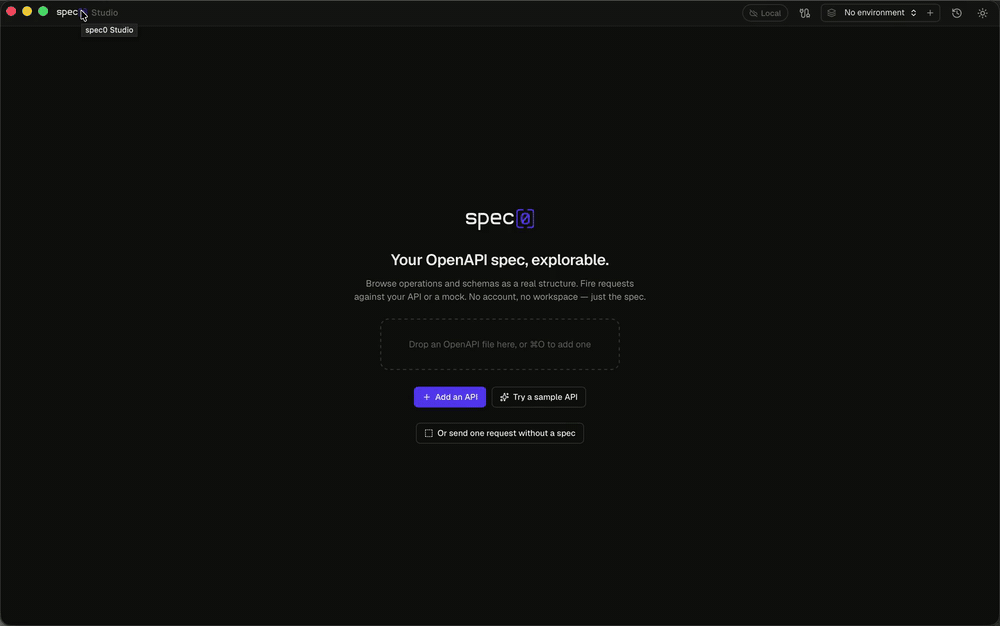

<h1 align="center">
  <picture>
    <source media="(prefers-color-scheme: dark)" srcset=".github/assets/spec0-studio-dark.svg">
    
  </picture>
</h1>

<p align="center">
  <a href="https://github.com/spec-0/studio/releases/latest"></a>
  <a href="https://github.com/spec-0/studio/actions/workflows/ci.yml"></a>
  <a href="LICENSE"></a>
</p>

**Spec0 Studio** is a desktop app for calling and testing APIs, built around your
OpenAPI spec.

<p align="center">
  
</p>

It's for developers who already have an OpenAPI spec (the YAML or JSON file that
describes an API). You open the spec, Studio builds the requests from it, and each
JSON response is checked against the schema the spec declares, so you notice when
the API and its description drift apart.

Studio is free and open source (MIT) and works without an account. It's young,
and we'd like to hear what breaks.

## Download

These links always point to the newest version:

| Platform | File | Notes |
|---|---|---|
| macOS 11 or later | [spec0-studio-macos-universal.dmg](https://github.com/spec-0/studio/releases/latest/download/spec0-studio-macos-universal.dmg) | Apple silicon and Intel. Signed and notarized by Apple. |
| Windows 10 and 11, x64 | [spec0-studio-windows-x64-setup.exe](https://github.com/spec-0/studio/releases/latest/download/spec0-studio-windows-x64-setup.exe) | Installs for your user only, no admin rights needed. Not code-signed, see the note below. |
| Linux x86_64 | [spec0-studio-linux-x86_64.AppImage](https://github.com/spec-0/studio/releases/latest/download/spec0-studio-linux-x86_64.AppImage) | Most distributions. Run `chmod +x` on it, then run it. |
| Debian, Ubuntu, x86_64 | [spec0-studio-linux-amd64.deb](https://github.com/spec-0/studio/releases/latest/download/spec0-studio-linux-amd64.deb) | `sudo apt install ./spec0-studio-linux-amd64.deb` |

- All files are on the [releases page](https://github.com/spec-0/studio/releases/latest).
  Each release includes a `SHA256SUMS.txt` file you can check a download against.
- On Windows, Studio uses Microsoft's WebView2 to draw its window. Windows 11 and
  current Windows 10 already have it; if yours doesn't, the installer downloads it
  from Microsoft.
- The Linux builds need WebKitGTK 4.1: Ubuntu 22.04, Debian 12 or newer, or
  another distribution of about that age.

> [!NOTE]
> The Windows installer isn't code-signed yet, because we don't have a Windows
> code-signing certificate. Windows SmartScreen will probably say "Windows
> protected your PC" and call the publisher unknown. To continue, click
> **More info**, then **Run anyway**. If you'd rather not, check the file against
> `SHA256SUMS.txt` first (in PowerShell: `Get-FileHash .\spec0-studio-windows-x64-setup.exe`),
> or [build Studio from source](#build-from-source).

### Updates

Choose *Check for Updates…* (in the app menu on macOS, the Help menu on Windows
and Linux), or *Check for updates now* in Settings under Updates, to see whether
there is a newer version and install it.

- Every update is signed, and Studio refuses an update whose signature doesn't match.
- An AppImage replaces itself.
- A `.deb` install asks for your password (through `pkexec`) to install the new package.
- On Windows the installer runs and then Studio starts again.

## How this differs

If you use Postman, Insomnia, Bruno or Yaak, the main differences are:

- **It starts from your OpenAPI spec.** Requests are built from the spec, not from
  a collection you maintain alongside it. Studio's collections point at
  operations in your specs instead of copying them.
- **It checks responses against the spec.** Each JSON response is validated
  against the schema the spec declares for that status code, and fields the spec
  doesn't mention are flagged.
- **It works with no account and sends no telemetry.** History and environments
  stay on your machine, and secrets go in your operating system's credential store.
- **It's younger and does less.** There is no scripting, no shared team workspace,
  no import of collections from other tools yet, and no gRPC or WebSocket support. Mock servers are
  available only through the optional [Spec0 connection](#connecting-to-spec0-optional).

## Features

The top bar has five tabs: **APIs** (your library and the API you have open),
**Collections**, **History**, **Mocks** and **MCP**. An open API has its own tabs underneath:
**Operations**, **Schemas**, **Graph** and **Document**. The environment picker,
whether you're local or signed in, and Settings (⌘, or Ctrl+,) are on the right.

### Your specs

- **Three sources.** Add an API from a local file, a URL, or a Spec0 account.
  OpenAPI 3.0 and 3.1, YAML or JSON.
- **Swagger 2.0 too.** Studio converts a Swagger 2.0 spec to OpenAPI 3.0 when you
  open it, on your computer, and says so on the API. The Raw tab still shows the
  file as imported.
- **Open in Studio.** "Open in Studio" buttons on Spec0's public API registry
  (links starting with `spec0://`) open the API here, after you confirm.
  Studio shows where the spec would be downloaded from and fetches nothing
  until you press Open.
- **Kept locally.** Studio keeps a copy of the spec's text, so it opens quickly,
  works offline and still works if the file moves.
- **Operations and schemas.** Browse operations by tag, and browse schemas (the
  data models) in their own tab: fields, what each schema uses and is used by, and
  an example. The Graph tab shows how the schemas refer to each other.
- **Raw and reference views.** The Document tab shows the spec as raw text or as
  a readable API reference. Both work offline.
- **Git details.** If the spec file is in a git repository, Studio shows its
  branch, commit, and whether the file has changed since that commit.

### Sending requests

- **Forms from the spec.** A list of allowed values becomes a dropdown, a
  true/false becomes a toggle, and request bodies start filled in with the real
  field names.
- **Any target.** Point a request at the spec's server, `localhost`, or any other address.
- **No CORS problems.** Requests are sent by the app itself, not by a web page, so
  browser CORS rules (which stop a web page from calling other sites) don't get in
  the way. No proxy needed.
- **Bodies and files.** JSON bodies, form bodies, and file uploads. Binary
  responses such as images or PDFs show inline or can be saved to disk.
- **Request tabs.** Each operation you open gets a tab under the API bar, across
  APIs, so you can move between requests in different APIs without losing your
  place. Close a tab with its ×, a middle-click or ⌘W. Tabs are there again
  when Studio reopens. Up to 20 are kept; opening more closes the one you used
  longest ago, but never one with unsent changes.
- **Unsent changes are kept.** What you type into a request stays with that
  operation when you move to another one, another API or another tab, and
  after a restart. A dot on the tab and in the sidebar shows which requests
  have unsent changes, and **Discard changes** goes back to the values the spec
  suggests. Once a request is sent, what you sent is what it opens with next
  time. Auth values you type straight in are kept only until Studio quits;
  a `{{reference}}` to an environment is kept.
- **The last response comes back with its request.** Going back to a request
  you sent earlier in the same session shows its last response, marked with
  the time it was sent, and says so if you've edited the request since. After a
  restart, earlier responses are in History.

### Checking responses

- **Schema checks.** Each response is checked against the schema the spec gives
  for that status code, including fields the API returns that the spec doesn't mention.
- **Conformance runs.** Run every operation in a tag or in the whole spec and see
  which responses match the spec. Only read-only requests (like GET) run unless
  you choose otherwise. Requests run one at a time, can be cancelled, and the
  result can be exported as Markdown.

> [!IMPORTANT]
> Only JSON response bodies are checked against the spec. Headers, content types,
> and status codes the spec doesn't list aren't checked yet.

### Environments and sign-in

- **Environments** are named sets of values, such as `{{baseUrl}}` or `{{token}}`,
  that you can use in the URL, headers, auth and body.
- **Secrets.** A value can be marked secret. The secret goes into your operating
  system's credential store, and the environment file only notes that the secret
  exists, so the file is safe to commit.
- **OAuth 2.0.** Studio can get tokens for you, using client credentials or the
  authorization code flow with PKCE in your browser. Settings are pre-filled from
  the spec where it has them.

### Company networks

These are in Settings, under Network.

- **Private certificate authorities** can be trusted for specific hosts.
- **Proxy settings**, including `HTTPS_PROXY` and `NO_PROXY`.
- **Timeouts and redirects.** Redirect control (Studio shows each redirect it
  followed), and a cookie jar per API that you can inspect and clear.

### History

- **Local, for 30 days.** Every request is saved on your computer with what came
  back and the check result. One list covers all your APIs and scratch requests,
  and you can filter it by API, status, drift, or mock and real.
- **Read-only.** A saved request opens read-only. To run it again, copy it to a
  new request. History is never synced anywhere.

### Collections

A collection runs steps in order, often across several specs: create an order,
get it, pay for it. Each step points at an operation in one of your specs, so
its response is checked against that spec.

- **Creating, renaming and removing.** A new collection asks for its name first,
  from the **+** in the list or from **Add to collection ▸ New collection…**.
  Rename one by clicking its name in the header, or right-click it in the list
  for **Rename…** and **Delete…** (deleting asks first).
- **Adding steps.** Right-click an operation (or press Shift+F10) and choose
  **Add to collection**. The operation on screen is added with what you've filled
  in. A request in History can be added too, with the values it was sent with.
- **Each step has its own inputs and target**: parameters, headers, body, and
  where it goes (any of the API's servers, its hosted or local mock, or a URL
  you type). Reorder steps by dragging, or with Alt+↑ and Alt+↓.
- **The step menu.** Right-click a step, or use its **⋯** button, for **Change
  operation…**, **Duplicate**, **Move up**, **Move down** and **Remove step**.
  Delete removes the selected step while the step list has focus. Removing a
  step that later steps take values from says which ones first.
- **Passing values between steps.** A later step can take a value from an
  earlier step's response, such as the id of the order step 1 created. Use the
  link button next to a field, **Take a body field from an earlier step** under
  a body, or click a value in a step's response and choose **Use in a later
  step**. Pick the field to fill and the value to fill it with: from the last
  run's response, or from the response the spec declares if nothing has run
  yet. The field then shows where its value comes from ("from createOrder →
  body.id") instead of the value, with **Change** and a way to remove it.
  Fields inside a JSON body work too, such as `items[0].sku`. In the file a
  link is a reference like `{{steps.createOrder.body.id}}`, so hand-written
  references work the same way.
- **The Chain view** (**Steps | Chain | Runs** in the collection header) shows
  every step in order, what each one gives to later steps and takes from
  earlier ones, with a line from each value to the field it fills, and every
  link again in a list. After a run, each link shows the value it passed
  (secrets hidden). A link that can't work is shown in red with the reason: its
  step was removed, it now runs after the step that uses it, or the field wasn't
  in the last response. Each one has a fix, such as moving the step back or
  choosing another value. Moving a step in a way that would break a link asks
  first.
- **Run** sends the steps one at a time, stops at the first failure (you can turn
  that off), and shows for each step whether it passed: the status it expects
  and a response that matches its spec. The run is one entry in History.
- **Run log.** **Runs** in a collection lists its last 20 runs. Each run's log
  shows the steps in order: when each started, its method, URL and target, the
  status, the expected status, the schema check, and whether it passed. It shows
  which values were passed from earlier steps and the value used, and any that
  couldn't be resolved. A failure says why (network error, unexpected status,
  schema difference, unresolved value), and a step that didn't run says why it
  was skipped. Copy a log as text, or export it as JSON or text.
- **Expected status.** A step expects any 2xx unless you say otherwise. Set
  **Expects** on a step to a code like `404` or a range like `4XX` to test a
  failure case, such as getting a deleted order or paying twice. The step then
  passes when that status comes back and the response matches what the spec
  declares for it. If the spec declares nothing for that status, the step
  passes on the status and says the body wasn't checked.
- **Importing from Postman.** Use **Import…** or drop a Postman collection
  (v2.1 or v2.0 JSON) on the Collections tab. It becomes one collection, with
  folder names at the start of each step's name. Each request is matched to an
  operation in your library by method and path, against each spec's servers
  (including a `{{baseUrl}}` whose value is in the collection). Matched
  requests become linked steps; the rest are kept as plain requests, marked
  *not in any spec*, and can be linked later. Headers, query and path values,
  bodies and auth come across. Tokens, passwords and API keys typed into
  Postman are never written into the collection: they become `{{variables}}`,
  and you choose whether their values go into a new environment along with the
  collection's variables. Studio doesn't run Postman scripts. A test that
  checks a status sets the step's expected status, and a script that saves a
  response value, such as `pm.environment.set("orderId", pm.response.json().id)`,
  becomes a reference in the later steps that use it. A summary afterwards
  lists what matched, what didn't, and anything that needs your attention.
  Insomnia and Bruno files aren't supported yet.
- **When a spec changes**, a step that no longer matches it is marked with what
  changed, and a step whose operation is gone can be linked to another one.
- **Saving.** Collections are kept in Studio. You can also export one to a file,
  import one, or save it to a folder, for example in a git repository, and keep
  it linked: Studio re-reads the file when you come back to the window, and asks
  which version to keep if both changed. Files are YAML
  (`checkout.spec0-collection.yaml`) and never contain secret values; specs are
  referred to by path relative to the file, by URL, or by their Spec0 name.

### Keyboard shortcuts

Use Ctrl instead of ⌘ on Windows and Linux.

| Keys | Action | Keys | Action |
|---|---|---|---|
| `⌘↵` | Send | `⌘E` | Environments |
| `⌘O` | Add API | `⌘\` | Response pane |
| `⌘P` | Switch API | `⌘1` to `⌘4` | Operations, Schemas, Graph, Document |
| `⌘L` | All APIs | `⌘D` | Theme |
| `/` | Search | `⌘,` | Settings |
| `Ctrl+Tab` | Next request tab | `Ctrl+Shift+Tab` | Previous request tab |
| `⌘W` | Close request tab | `Esc` | Close |

On macOS, `⇧⌘]` and `⇧⌘[` also move between request tabs, and `⇧⌘W` closes the
window. `Ctrl+Tab` is Ctrl on every platform.

### Console

**Console** in the status bar (`⇧⌘Y`, or `Ctrl+Shift+Y`) opens a log of this
session: requests as they're sent and answered, collection runs (with a link to
each run's log), requests to local mocks, and MCP tool calls (the tool's name
and whether it worked, never its arguments). It can be filtered and copied, keeps
the last 1,000 entries, and a badge counts new errors. It is kept in memory only.

### Performance

On Stripe's public spec (7.6 MB, 589 operations, 1440 schemas), Studio takes
about 30 ms to read the spec and about 16 ms to build examples for every schema,
on our machines. It gets there by looking up `$ref` references only when they
are needed, rather than expanding the whole document up front. That is also what
keeps schemas that refer to themselves from causing problems.

## Privacy

Studio is often used with private, internal APIs, so it should talk only to the
servers you point it at.

- **No telemetry, analytics or crash reporting.** Studio makes no request you
  didn't ask for.
- **The API reference view makes no network requests.** It is given the spec's
  text, never a URL. If a spec's description links to a remote image, the image
  is not loaded, because loading it would tell the spec's author that you opened it.
- **A Content Security Policy** (a set of rules the app's window enforces) blocks
  other network requests from the interface, whatever a bundled library tries to do.
- **Auth values are not stored per API.** They go in an environment, where they
  can be marked secret. There is one place for secrets, not two.
- **Secret values are kept in your operating system's credential store**: the
  macOS Keychain, Windows Credential Manager, or the Secret Service on Linux.
  History, error messages, exported reports, saved unsent changes, run logs and
  the console show `{{name}}` in place of a secret value.
- **Logs stay on this computer.** Collection run logs are saved next to your
  other Studio data (the last 20 runs per collection); the console is kept in
  memory and is gone when Studio quits. Neither is sent anywhere.
- **Certificate checks are never switched off everywhere at once.** You can turn
  them off for one host at a time, and Studio reminds you when you send a
  request to that host.
- **Update checks happen only when you ask.** *Check for Updates…* sends one
  request to github.com for the latest release. There is a setting to check each
  time Studio starts; it is off unless you turn it on. The check sends nothing
  about your specs, environments or history, and it uses the proxy from your
  Network settings.
- **Links from web pages ask first.** A `spec0://` link can be triggered by any
  web page, so Studio shows the API's name, the host it would download from and
  the full address, and downloads nothing until you press Open. It only accepts
  `https` addresses on public hosts: never `localhost`, your private network,
  or an address with a password in it.
- **The local MCP server exists only when you turn it on.** It listens on this
  computer only (`127.0.0.1`), answers only requests that carry its token, turns
  away web pages, and stops when Studio quits. It never shares secret values.
- **A local mock listens only when you start it, and only on this computer.**
  It uses `127.0.0.1`, answers web pages only when they are served from
  `localhost`, and stops when you stop it or quit Studio.

> [!WARNING]
> If the credential store can't be reached (mostly on Linux without a running,
> unlocked keyring such as GNOME Keyring or KWallet), Studio keeps secret values
> in a local file that is not encrypted, and says so in the environments dialog.
> The values move to the credential store the next time Studio starts and can reach it.

## Connecting to Spec0 (optional)

Everything above works without an account. If your team uses
[Spec0](https://spec0.io), you can sign in to browse your organisation's APIs,
pull their specs, use hosted mock servers as request targets, and publish a
local spec to your organisation. The Mocks tab lists your organisation's hosted
mock servers. Sign in and out in Settings, under Account & Spec0. Signing out
returns Studio to local-only use, and nothing is lost.

## Local mocks

Start a mock of any API in your library on this computer. It needs no account
and no network, and answers every operation in the spec.

**Starting one.** Press **Local mock** on an API's card, in the bar of an open
API, or in the **Mocks** tab under *On this computer*. The mock gets its own
address, starting at `http://127.0.0.1:4010`; if that port is taken, the next
free one up to 4099. An API keeps its port the next time you start it. Several
APIs can run at once. While a mock runs it is offered as a target in the
address bar (*Local mock · 127.0.0.1:4010*), and a green dot shows on the API
and on the Mocks tab. Nothing starts by itself, and every mock stops when Studio
quits.

**What it answers.** The operation is found from the method and path, with or
without the spec's base path (both `/orders` and `/v1/orders` work for a server
of `https://api.example.com/v1`). It answers with the lowest 2xx response the
spec declares. The body is the spec's example for that response if it has one,
then the schema's example, then a value built from the schema the same way
Studio fills in request bodies (property examples, defaults, enums, formats).
The `Content-Type` is the one in the spec.

- Ask for a different response with `Prefer: code=404`, `X-Mock-Status: 404` or
  `?__status=404`, and for a named example with `Prefer: example=name`.
- An unknown path gets a `404` listing the closest operations; a method the path
  doesn't take gets a `405` with an `Allow` header.
- A request that doesn't match the spec (a missing required parameter, a wrong
  type, a body that doesn't fit the schema) still gets an answer, with the
  problems listed in the `X-Spec0-Mock-Warnings` header. In the Mocks tab you
  can ask for a `400` instead.

**Web pages.** A frontend running on `localhost` or `127.0.0.1` (any port) can
call a local mock from the browser: preflight requests are answered and the
responses carry CORS headers. Requests from any other website are refused, so a
page you have open can't read your specs through the mock.

**Hosted mocks** are still there for sharing a mock with your team.

## Local MCP server

Studio can run a small [MCP](https://modelcontextprotocol.io) server so that AI
coding agents on your computer, such as Claude Code or Cursor, can ask it about
your APIs, including specs you haven't published anywhere.

**Turning it on.** Open the **MCP** tab (or Settings → MCP) and press *Start*.
The panel shows the address (`http://127.0.0.1:47321/mcp` unless that port is
taken), a token, and setup commands to copy for Claude Code, Cursor and other
clients. It is off until you start it. You can ask for it to start with Studio;
that is off by default too.

**What agents can see.** The APIs in your library (titles, versions, servers,
operations and the spec text), your environments' variable names and the values
of variables that aren't secret, and whether you're signed in to Spec0. When you
are signed in, agents can also get an API's hosted mock server (its address and
key) and create or rebuild one for an API that's already published.

**What it doesn't do.** Agents don't send requests through Studio: they get
URLs and call them themselves. Secret values are never shared. For searching
every API in your organisation, use the Spec0 MCP server instead; this one only
knows what's on your computer.

**Privacy.** The server listens on `127.0.0.1` only, so other computers can't
reach it. Every request needs the token, which is generated on your computer
(you can make a new one at any time). Requests from web pages are refused. The
server runs only while Studio is open.

## Known limitations

- **Only JSON response bodies are checked** (see [Checking responses](#checking-responses)).
- **Collections run in Studio only.** There is no command-line runner yet, and
  an OAuth step uses the token Studio already holds for that API and
  environment; get one from the API's Auth section first.
- **The Windows and Linux builds are new** and have had much less use than the
  Mac build. Please [open an issue](https://github.com/spec-0/studio/issues) if
  something looks or works wrong.
- **The Windows installer is not code-signed**, so SmartScreen warns about it
  (see [Download](#download)).
- **Windows and Linux builds are x86_64 only.** There are no ARM builds for them yet.
- **Linux needs WebKitGTK 4.1** (see [Download](#download)).
- **Update checks use Studio's proxy setting, but not its certificate settings.**
  If your network inspects encrypted traffic with a private certificate
  authority, the check may fail. Download new versions from the releases page
  instead.
- **A local mock answers from examples, not state.** A `POST` doesn't change what
  the next `GET` returns, and XML responses are sent as JSON.
- **Some example values are placeholders.** When a field has no example, no
  format and an unfamiliar name, Studio fills in something like `"string"`,
  which you'll want to replace.
- **Secrets can fall back to a plain file** when there is no credential store
  (see [Privacy](#privacy)).
- **The app is allowed to make HTTP requests to any host**, because an API
  client has to reach whatever address you give it.

## Build from source

You need Node 20 or later and a Rust toolchain. On Linux you also need
[Tauri's system packages](https://v2.tauri.app/start/prerequisites/#linux)
(WebKitGTK 4.1 and a few others).

```bash
npm install
npm run app            # run the desktop app
npm run dev            # preview the interface in a browser at localhost:5173
```

The browser preview is handy for styling, but requests to other sites will be
blocked by CORS there, because it is a web page. In the desktop app they go out
through Rust. The status bar tells you which one you are in.

```bash
npm test               # unit tests
npm run type-check     # TypeScript check
npm run app:build      # installers for your platform (.dmg, .AppImage/.deb, .exe)
```

## Feedback and contributing

- **Questions, ideas, or "I tried it, here's what I thought"**: start a thread in
  [Discussions](https://github.com/spec-0/studio/discussions).
- **Bugs**: [open an issue](https://github.com/spec-0/studio/issues/new/choose).
- **Security problems**: report them privately, as described in [SECURITY.md](SECURITY.md),
  rather than in a public issue.
- **Pull requests** are welcome. Please read [CONTRIBUTING.md](CONTRIBUTING.md) first.

## Licence

MIT, copyright (c) 2026 Spec0. See [LICENSE](LICENSE).
The Spec0 name and logo are used to identify this project and aren't covered by the MIT licence.
